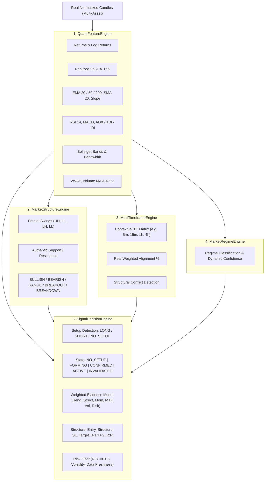

# NEXUS AI — Аудит Аналитических и Сигнальных Модулей (Phase 2)

**Дата аудита:** 27 сентября 2026 г.  
**Репозиторий:** `https://github.com/imceobitchuzb/aiscanner`  
**Цель:** Выявление всех мест формирования торговых сигналов (`BUY`, `SELL`, `LONG`, `SHORT`), расчёта вероятностей, уверенности моделей, скоринга сетапов, уровней Entry/SL/TP, R:R и рыночных режимов.

---

## 1. Реестр Существующих Аналитических Модулей

| Модуль | Входные данные | Используемая формула / Модель | Выходные данные | Источник / Статус |
|---|---|---|---|---|
| **`lib/quant/signalScoring.ts`** | `candles`, `regime`, `structure`, `mtf` | Аддитивная сумма баллов (Trend max 20, Momentum max 20, Structure max 20, Volume max 15, MTF max 15) минус штрафы за риск и новости. | `AISignal`, `SignalQualityBreakdown` | **ПРОБЛЕМА:** Зашит произвольный штраф `newsPenalty = 2`. Условие `overallScore >= 60` грубо делило рынок на LONG/SHORT без проверки валидности сетапа (`NO_SETUP`). Фиктивная уверенность `confidence = Math.round(overallScore * 0.95)`. |
| **`lib/quant/marketStructure.ts`** | `candles` | Фрактальное определение локальных экстремумов (окно 3). Поиск FVG и Order Blocks. | `MarketStructure` (trend, support, resistance, FVG, OB) | **ПРОБЛЕМА:** При отсутствии уровней использовались фиктивные коэффициенты: `currentPrice * 0.97` (поддержка) и `currentPrice * 1.03` (сопротивление), а при < 20 свечах `p * 0.98` и `p * 1.02`. |
| **`lib/quant/multiTimeframe.ts`** | `candles` | Разрежение базового массива свечей шагами `(index + 1) * 6` для псевдо-таймфреймов 1m-1D. | `MultiTimeframeAnalysis` (rows, alignmentScore, conflicts) | **ПРОБЛЕМА:** Таймфреймы не запрашивались из реальных источников, а симулировались из одной серии свечей. `alignmentScore` искусственно зажимался в диапазон `42% – 96%`. |
| **`lib/quant/probabilisticForecast.ts`** | `candles`, `regimeState`, `horizonPeriods` | Параметрический конус диффузии: $\sigma = \text{std}(\ln(C_t/C_{t-1}))$, центр $P_0 e^{\mu t}$. | `ProbabilisticForecast` (cone, scenarios) | **ПРОБЛЕМА:** Сценарии несли ложные фиксированные вероятности (58%/24%/18% для BULL, 64%/22%/14% для BREAKOUT) с надписью `probability`, хотя калибровка на истории отсутствовала. |
| **`lib/quant/digitalTwin.ts`** | `currentPrice`, `deltaPercent`, `leverage` | $PnL = \text{delta} \times \text{leverage}$, $Liq = P_0 (1 \mp 1/\text{leverage} \pm 0.01)$. | `DigitalTwinSimulation` | **ПРОБЛЕМА:** Формула вероятности прибыли `52 + delta * 1.8` являлась линейной эвристикой без опоры на распределение доходностей. |
| **`backend/main.py`** | `symbol` (или запрос) | Скользящие средние EMA20, ATR и процентное отклонение. | `RegimeResponse` | **ОБНОВЛЕНО:** В Phase 1 удален список `is_bull`, заменен на реальный расчёт EMA и ATR. |

---

## 2. Детальный Анализ Выявленных Дефектов в `signalScoring.ts`

### Дефект 1: Отсутствие состояния `NO_SETUP`
- **Код:**
  ```typescript
  if (overallScore >= 60) {
    if (regime === 'TRENDING_BULL' || ...) direction = 'LONG';
    else if (regime === 'TRENDING_BEAR' || ...) direction = 'SHORT';
  }
  ```
- **Следствие:** Любой рынок с суммой баллов $\ge 60$ принудительно получал направление сделки, даже если рынок находится в хаотичном боковике, волатильность зашкаливает, или R:R отрицательный.

### Дефект 2: Отсутствие отдельной логики для SHORT
- Логика SHORT была реализована как простое зеркальное отражение условий LONG с инвертированными знаками индикаторов. На реальном рынке распределение падений (импульсные продажи, ликвидации, расширение спреда) асимметрично восходящим трендам.

### Дефект 3: Произвольные уровни Entry, Stop Loss и Take Profit
- **Код:**
  ```typescript
  const entrySpread = currentATR * 0.25;
  const stopDistance = Math.max(currentATR * 1.5, Math.abs(currentPrice - structure.keySupport));
  const takeProfit1 = isLong ? currentPrice + stopDistance * 1.5 : currentPrice - stopDistance * 1.5;
  const takeProfit2 = isLong ? currentPrice + stopDistance * 2.8 : currentPrice - stopDistance * 2.8;
  const riskRewardRatio = (Math.abs(takeProfit2 - currentPrice) / Math.abs(currentPrice - stopLoss)) || 2.4;
  ```
- **Следствие:** Если реального таргета (уровня ликвидности/сопротивления) на графике нет, система просто умножала стоп на `1.5` и `2.8` и подставляла `2.4` при делении на ноль. Это не торговый план, а механическая генерация чисел.

### Дефект 4: Отсутствие фильтра риска (Risk Gate)
- Если расчетный R:R получался `0.8` (риск превышает прибыль), сигнал всё равно отправлялся пользователю как активная рекомендация.

---

## 3. Архитектура Нового Количественного Ядра (Phase 2)


