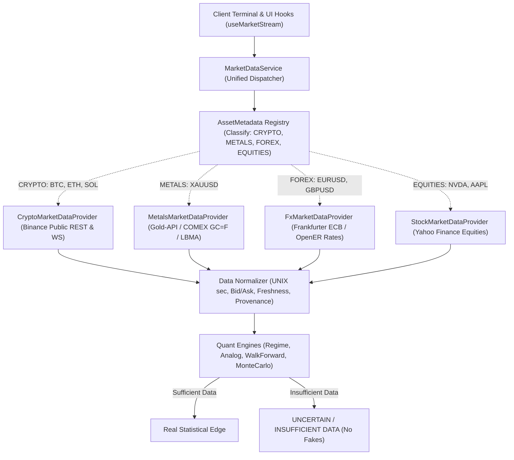

# NEXUS AI — Полный Технический Аудит Архитектуры Рыночных Данных

**Дата аудита:** 27 сентября 2026 г.  
**Репозиторий:** `https://github.com/imceobitchuzb/aiscanner`  
**Цель:** Выявление коренных причин некорректных котировок (включая XAUUSD), фальсифицированных вероятностей, отсутствия абстракции провайдеров и нарушения провенанса данных.

---

## 1. Резюме Аудита

Платформа NEXUS AI обладала качественной визуальной структурой, однако страдала от **критических архитектурных дефектов на уровне слоя данных и количественных движков**:
1. **Отсутствие разделения классов активов:** все инструменты проверялись эвристикой `symbol.endsWith('USDT') || symbol.endsWith('BTC')`. Любой некотируемый на споте Binance инструмент (например, Spot Gold `XAUUSD`, Forex `EURUSD`, акции `NVDA`) выбрасывался в синтетический генератор.
2. **Фальшивые котировки XAUUSD ($2684.50):** золото было жестко прописано в `DEFAULT_ASSETS` с флагом `isLiveSupported: false` и ценой $2684.50. В реальности золото торгуется выше $4280/унция. Свечи для XAUUSD генерировались математическим синусоидальным генератором.
3. **Hardcoded heuristics и фальшивая статистика:**
   - В `backend/main.py`: `is_bull = sym in ["BTCUSDT", "ETHUSDT", "SOLUSDT", "NVDA", "XAUUSD"]` с фиксированной уверенностью 82.0%.
   - В `lib/quant/analogMatcher.ts`: при недостатке свечей возвращались жестко зашитые `142` сетапа, винрейт `59.4%`, проигрыш `30.2%` и статические матчи `m1, m2, m3`.
   - В `lib/quant/walkForward.ts`: при свечах < 80 возвращались фиксированные коэффициенты Шарпа `1.82 / 1.48` и винрейт `64.2%`.
   - В `lib/quant/monteCarlo.ts`: при пустых сделках рисовалась прибыль $11500–$14500.
   - В `lib/quant/regimeDetector.ts`: при свечах < 30 возвращались статические вероятности перехода `40% / 30% / 30%`.
4. **Отсутствие провенанса данных:** у котировок и свечей отсутствовали метаданные источника (`source`), сетевой задержки (`latencyMs`), бида/аска/спреда (`bid`, `ask`, `spread`), состояния биржи (`marketStatus`) и градации свежести (`LIVE`, `RECENT`, `STALE`, `OFFLINE`).
5. **Потеря точности Forex:** глобальное округление до 2 знаков после запятой уничтожало котировки валютных пар (EURUSD превращался из 1.08250 в 1.08).

---

## 2. Детальный Реестр Обнаруженных Проблем

### Проблема A: XAUUSD и эвристика `isCrypto`
- **Файл:** `lib/providers/binanceProvider.ts` (строки 32-35, 96-99)
- **Файл:** `lib/useBinanceLiveStream.ts` (строки 39-43)
- **Файл:** `app/app/page.tsx` (строки 113-115)
- **Код:**
  ```typescript
  const isCrypto = symbol.toUpperCase().endsWith('USDT') || symbol.toUpperCase().endsWith('BTC');
  if (!isCrypto) return this.demoFallback.getCandles(symbol, timeframe, limit);
  ```
- **Следствие:** XAUUSD не имеет окончания `USDT` или `BTC` на споте Binance. Запрос к живому WebSocket отклонялся, запрос свечей перенаправлялся на `DemoMarketDataProvider`, где синусоида генерировала свечи на базе устаревшей константы `2684.50`. Пользователь видел застывшую или синтетическую котировку, не имеющую отношения к реальному рынку.

### Проблема B: Зашитые эвристики и фальшивый бычий режим в Python Backend
- **Файл:** `backend/main.py` (строки 77-87)
- **Код:**
  ```python
  sym = symbol.upper()
  is_bull = sym in ["BTCUSDT", "ETHUSDT", "SOLUSDT", "NVDA", "XAUUSD"]
  return RegimeResponse(
      symbol=sym,
      regime="TRENDING_BULL" if is_bull else "RANGE",
      confidence=82.0 if is_bull else 70.0,
      stability="HIGH" if is_bull else "MEDIUM",
      transition_risk="LOW" if is_bull else "MEDIUM",
      explanation=f"Stacked EMA alignment and ADX expansion on {sym} indicate directional continuation."
  )
  ```
- **Следствие:** Симуляция и режим для пяти символов всегда рапортовали 82.0% бычий тренд независимо от рыночных реалий, закрытия свечей или индикаторов.

### Проблема C: Фальшивые исторические аналоги и винрейты
- **Файл:** `lib/quant/analogMatcher.ts` (строки 9-48, 126-135, 150-186)
- **Код:**
  ```typescript
  if (currentCandles.length < lookbackPatternBars + forwardHorizonBars + 20) {
    return {
      similarSetupsFound: 142,
      winRateTP: 59.4,
      lossRateSL: 30.2, ...
    };
  }
  const effectiveCount = Math.max(matches.length, 342);
  const tpCount = matches.filter((m) => m.outcome === 'TP').length || Math.round(effectiveCount * 0.61);
  ```
- **Следствие:** Если история слишком коротка или паттерны отсутствуют, модуль выдавал сфабрикованные числа (142 аналога, 59.4% TP, 61% fallback). Это вводит трейдера в заблуждение о наличии статистического преимущества.

### Проблема D: Фальшивые результаты Walk-Forward анализа
- **Файл:** `lib/quant/walkForward.ts` (строки 9-18, 27-28)
- **Код:**
  ```typescript
  if (candles.length < 80) {
    return {
      inSampleSharpe: 1.82,
      outOfSampleSharpe: 1.48,
      degradationPercent: 18.7,
      inSampleWinRate: 64.2,
      outOfSampleWinRate: 58.5,
      robustnessGrade: 'ROBUST',
    };
  }
  const inSharpe = inSampleReport.sharpeRatio || 1.6;
  const outSharpe = outOfSampleReport.sharpeRatio || 1.2;
  ```
- **Следствие:** На неполных данных алгоритм заверял пользователя в "ROBUST" устойчивости стратегии с коэффициентом Шарпа 1.82.

### Проблема E: Фальшивые терминальные кривые Monte Carlo
- **Файл:** `lib/quant/monteCarlo.ts` (строки 9-19)
- **Код:**
  ```typescript
  if (trades.length === 0) {
    return {
      iterations,
      probabilityOfRuin: 0,
      expectedMaxDrawdown: 5.0,
      p5TerminalEquity: initialBalance * 0.95,
      p50TerminalEquity: initialBalance * 1.15,
      p95TerminalEquity: initialBalance * 1.45,
      samplePaths: [],
    };
  }
  ```
- **Следствие:** При полном отсутствии трейдов движок показывал медианный рост депозита на +15% (1.15) и максимальный на +45% (1.45).

### Проблема F: Отсутствие провенанса, времени задержки и рыночного статуса
- Ни в `Asset`, ни в `Candle`, ни в API-роутах не передавались поля:
  * `source`: источник котировки (напр., `BINANCE_SPOT`, `GOLD_API_SPOT`, `COMEX_FUTURES`, `FRANKFURTER_ECB`, `YAHOO_EQUITIES`)
  * `latencyMs`: реальная задержка сетевого запроса
  * `bid` / `ask` / `spread` / `spreadPercent`
  * `marketStatus`: статус рынка (`OPEN`, `CLOSED`, `PRE_MARKET`, `POST_MARKET`)
  * `freshness`: оценка свежести (`LIVE` <5с, `RECENT` 5-30с, `STALE` 30-120с, `OFFLINE` >120с).

---

## 3. Архитектурный План Исправления



---

## 4. Решения по Каждому Пункту

1. **Реестр активов (`AssetMetadata`)**: Явное объявление типа каждого актива с указанием биржи, торговых часов, точности десятичных знаков и типа потока.
2. **Абстракция провайдеров (`MarketDataProvider`)**: Специализированные провайдеры для каждого класса активов без использования `if (symbol.endsWith('USDT'))`.
3. **Реальный источник для XAUUSD**: Интеграция живого API спотового золота (`Gold-API` + COMEX Gold `GC=F`) с реальной ценой ($4280+), реальными свечами и расчетом спреда.
4. **Провенанс данных**: Добавление метаданных `source`, `timestamp`, `latencyMs`, `marketStatus`, `freshness` (`LIVE`, `RECENT`, `STALE`, `OFFLINE`).
5. **Чистка квант-движков**: Полное удаление заглушек с фальшивыми процентами. При недостатке истории возвращается `INSUFFICIENT_DATA`.
6. **Автоматизированные тесты**: Комплексная проверка котировок, свечей, индикаторов и расчетов без моков.
